# IO-bound

## Выполнение синхронно в один поток:
### Время выполнения:
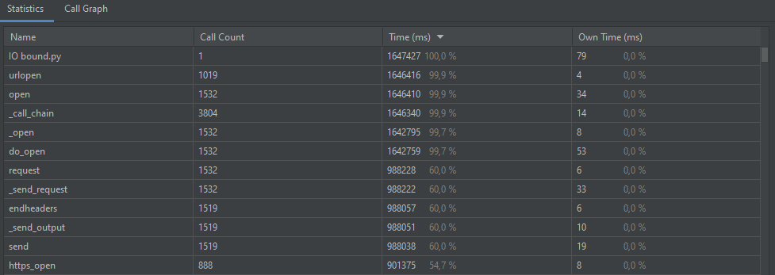
### Диспетчер задач:
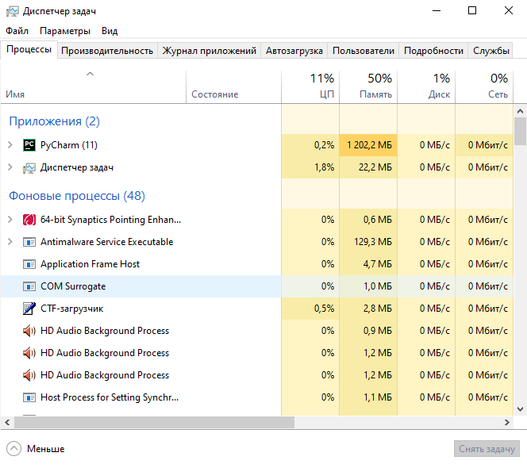

## Выполнение используя ThreadPoolExecutor:
## max_workers = 5
### Время выполнения:
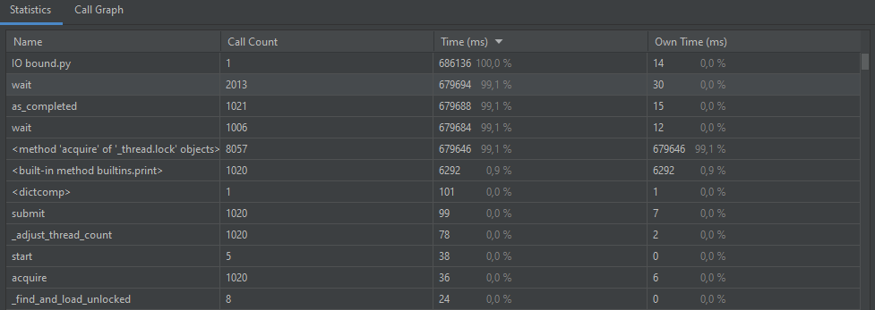
### Диспетчер задач:
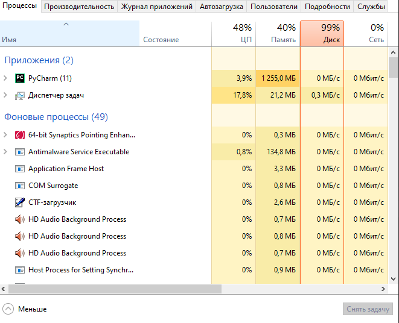

## max_workers = 10
### Время выполнения:
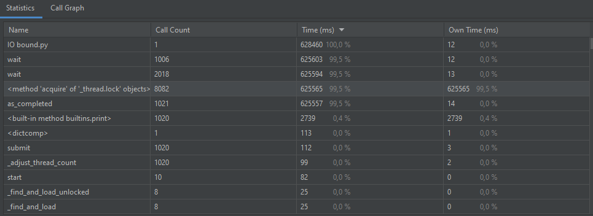
### Диспетчер задач:
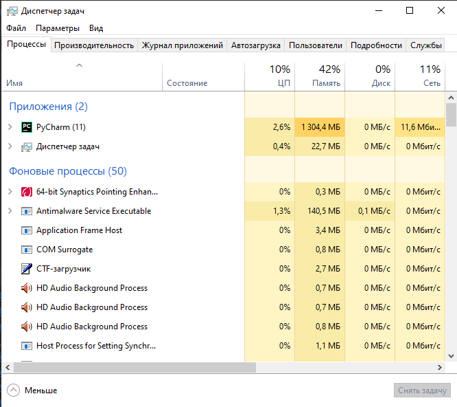

## max_workers = 100
### Время выполнения:
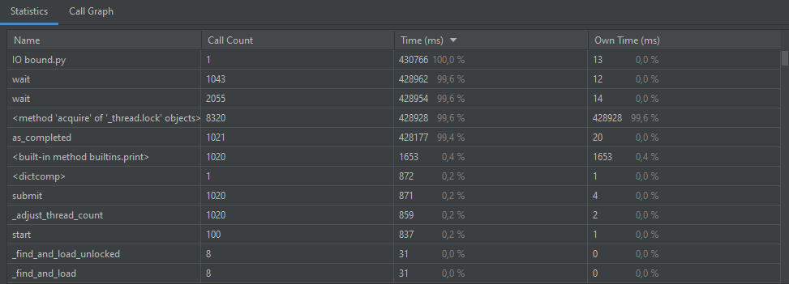
### Диспетчер задач:
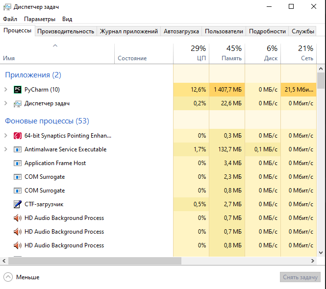

## При преобразованиях время выполнения  заметно уменьшается, а загрузка памяти отличается буквально на пару процентов, процессор(цп) в основном тоже одинаков, но бывают некие скачки и получается заметное отличие

# CPU-bound

## Выполнение на одном ядре:
### Время выполнения:
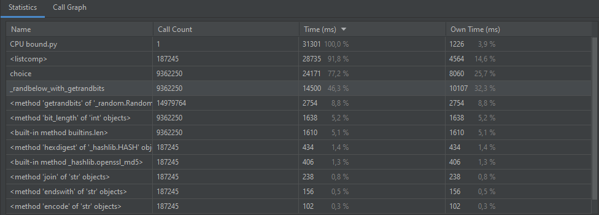
### Диспетчер задач:
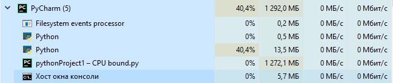

## Выполнение используя ProcessPoolExecutor:

## Воркер = 2:
### Время выполнения:
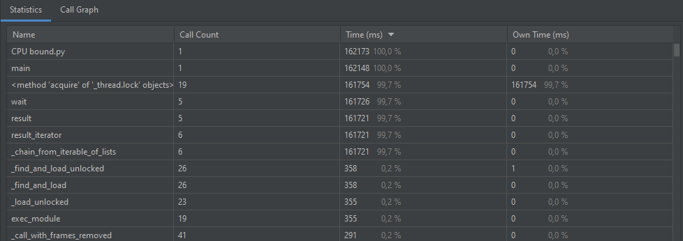
### Диспетчер задач:
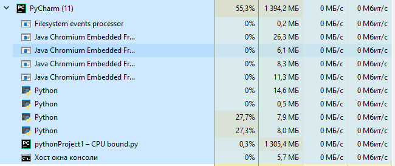

## Воркер = 4:
### Время выполнения:
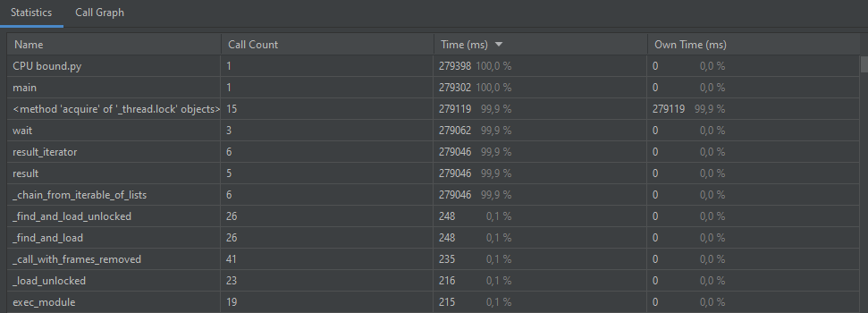
### Диспетчер задач:
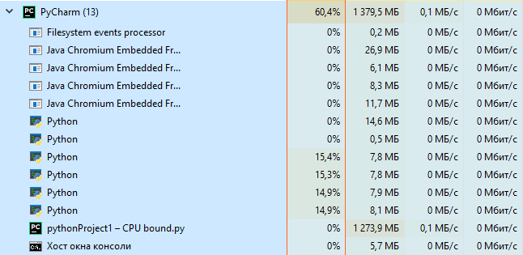

## Воркер = 5:
### Время выполнения:
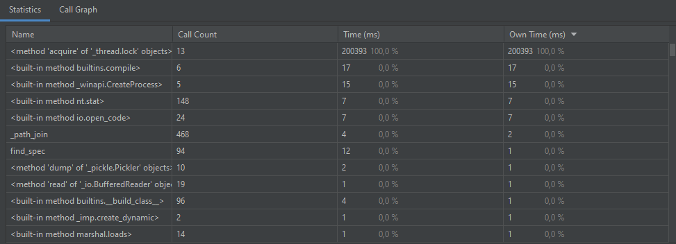
### Диспетчер задач:
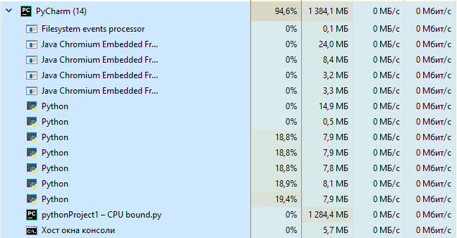

# Воркер = 10:
### Время выполнения:
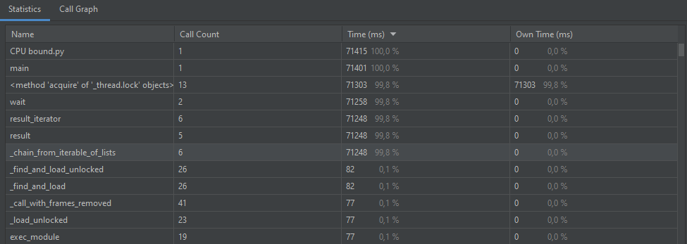
### Диспетчер задач:
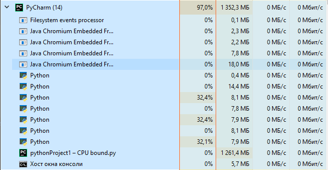

## Воркер = 100:
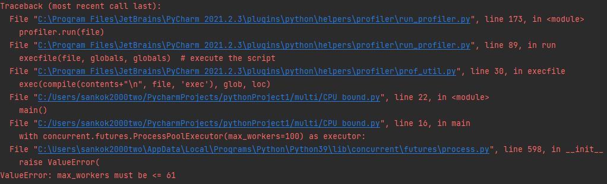

## Сильно меняется загрузка процессора, время выполнения уменьшается с увеличением количества воркеров. Максимальное количество воркеров - 61 из-за особенностей ОС.